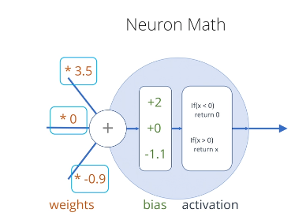

# Neural Network Basics

At a high level, we can think of a neural network as a function that takes in a matrix and returns another matrix.

The input and output matrices can be (likely are) of different dimensions.

## Network lifecyle

This is for supervised learning.

### Create the network

#### 1. Gather data

Create a table of labeled data. i.e., a table where each row represents one example of data, with some columns
for inputs and some columns for outputs.

If we were training a model to multiple two numbers, we would have 3 columns for our labeled data set:

e.g.,

2, 3, 6
1, -2, -2
4, 2, 8

The right-most column here is the "answer" column.

For this kind of training, all rows need to have the exact same number of columns.

#### 2. Define architecture

**"Fully connected" neural network.**
Connect _every_ node in each layer to every node in the next layer.

All you really have to define is how many layers you want and how many nodes in each layer.

Each neuron itself is basically just a function. It takes in inputs from the previous layer. It can adjust the result up or down a bit. It has an "activation."
If the input exceeds the activation, it passes a number along. Otherwise, it does not.



The neuron weights each input value to decide how much to pay attention to each input. The values are combined with simple addition. The shift up or down is called a "bias."

We always use a simple activation function in this course:

```py
if x < 0
  return 0

return x
```

As the network "learns," it is simply adjusting the weights and bias. This process is called "training."

Each neuron has simple weighting and activation. However, as you add more layers, you are able to represent
increasingly complicated mathematics by combining and chaining these simple calculations.

#### 3. Training loop

1. Show network input data

The network starts out random.

2. Calculate loss

How wrong was the network? You have to choose the loss function.

3. Back propigation

The loss is propigated back through the network. Each neuron can tell how much it contributed to the bad output, and then adjust accordingly. This is the most "magical" feeling step, but obviously it's still just math.

Tensors keep track of a "gradient" when they do calculation, which is what makes backprop possible.

4. Update

Actually update weights and biases based on result of back prop.

5. Repeat!

The network gets better with every "epoch," or cycle.
