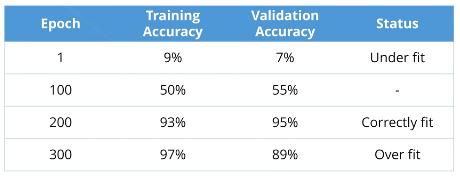

# Using real-world data

Best-case scenario: Fixed-set of known inputs and fixed-set of known outputs.

Most data is missing values, has some errors, etc.

1. Clean data
1. Train / validate / test split

## Train / validation / test

We need a way to know how good our model is. So we split our initial data set. We train on some of the data, and test against data that was never trained on.

These are the **Training** set and **validation** sets.

We may also introduce a third set - the **test** set. So you may have a tight "train-validate" loop and then test at the end.

You do **not** update the model based on how it performs against the validation set. Only the training set. Simply calculate and display the accuracy (loss), to know if the model is generalizing.

The test set is reserved at the very end of the training / validation so that the model can be used on data that has never been seen. Even though the validation set is not being fed into the model, it is being fed into the programmer, who may change the model to accommodate the validation set. Thus, the test set data is truly new to both the model and the programmer.

### Splitting data

We want to train on as much data as possible, and then evenly split the rest between validation and test.

- Training: 50-80%
- Validation: 10-25%
- Test: 10-25%

Depends on overall data set. You want as much training data as possible, so if 10% is a representative sample, then use 10% for test and validation.

#### Methods

**Independent data**

You can just split randomly if rows are unrelated.

**Dependent data**

_Time-series data_ is dependent. The rows relate to each other across time.

Best-practice is to use the beginning of the data set for training, and reserve the end (most-recent) for validation / test.

This is because our model will be used to predict the future. So we want to train a model on the oldest data that is successful at predicting the "future" - the most recent data.

## Overfit / underfit

If you go for 100% accuracy on training data, then you will train your model to predict the outliers in your test data. It will likely perform poorly on your test set.

If you stop with low accuracy on your test set, then your model will continue to be inaccurate on the training set.

_If you keep track of the model's training and validation accuracy over time, it may become clear when your best fit was._

### Fixing fit

You may find yourself _always_ overfitting or underfitting.

1. **Gather more data** Having more data is almost always better. The more you can feed into your model, the better it will generalize.
1. **Alter network architecture** Making the network smaller will prevent the model from "memorizing" the training data set. The opposite issue could occur though, where the model is too small to be accurate (simply cannot model the complexity of the data).
1. **Change hyperparamters** Loss function, optimizer, learning rate.

## Mini-batches

Typically you have too much data to feed into your model all at once. So you chunk it up and feed it in one mini-batch at a time.

Each training epoch (training loop) now consists of an inner loop, looping over the mini batches. This way, an "epoch" still represents one training loop over the entire training data set.

**Make your mini-batches as large as possible without running out of memory.**

Larger architectures require smaller mini-batches.
